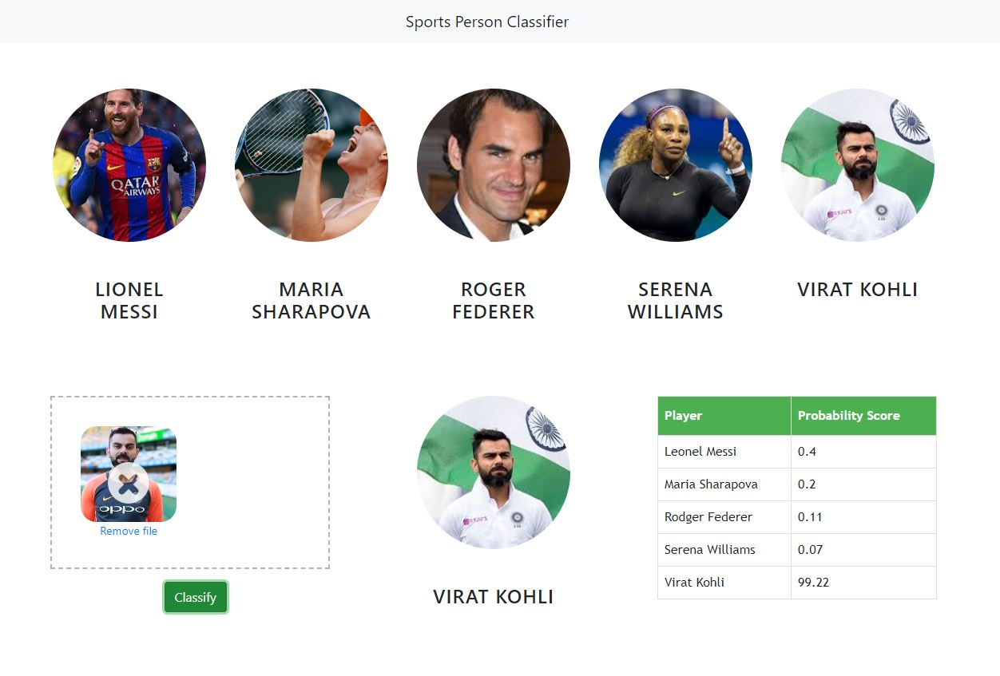

# 🎬 Celebrity Face Recognition System

<div align="center">
  <p><strong>Machine Learning-Based Sports Celebrity Face Classification</strong></p>
  <p>Identify famous sports personalities through intelligent face recognition and classification</p>
</div>

---

## 📋 Overview

**Celebrity Face Recognition** is a comprehensive machine learning project that uses computer vision and image processing techniques to recognize and classify faces of 5 famous sports personalities. The system combines advanced facial detection, feature extraction, and machine learning algorithms to achieve accurate classification through a user-friendly web interface.

This project demonstrates the practical application of image processing, feature engineering, and machine learning in building a complete production-ready solution with both backend processing and frontend interface.



In this data science and machine learning project, we classify sports personalities. We restrict classification to only 5 people,
1) Maria Sharapova
2) Serena Williams
3) Virat Kohli
4) Roger Federer
5) Lionel Messi

## ✨ Key Features

- **👥 5-Celebrity Classification**: Recognizes 5 sports personalities with high accuracy
- **📸 Image Upload Interface**: Intuitive drag-and-drop web interface for image submission
- **🔍 Face Detection**: Automatic face and eye detection using Haar Cascade Classifiers
- **🎯 Probability Scoring**: Provides confidence scores for each classification
- **🌊 Wavelet Transform**: Advanced image preprocessing using wavelet decomposition
- **⚡ Real-Time Processing**: Instant classification results from uploaded images
- **🎨 Modern UI**: Responsive Bootstrap-based web interface
- **🔌 REST API**: Flask-based HTTP server for classification requests
- **📊 Multiple Face Support**: Handles images with multiple faces and returns best match

## 🎬 Supported Celebrities

| # | Name | Sport |
|---|------|-------|
| 1 | **Virat Kohli** | Cricket 🏏 |
| 2 | **Serena Williams** | Tennis 🎾 |
| 3 | **Maria Sharapova** | Tennis 🎾 |
| 4 | **Roger Federer** | Tennis 🎾 |
| 5 | **Lionel Messi** | Football ⚽ |

## 🛠️ Technology Stack

| Component | Technology |
|-----------|-----------|
| **Backend Language** | Python 3 |
| **Web Framework** | Flask |
| **Machine Learning** | Scikit-learn (SVM) |
| **Image Processing** | OpenCV, NumPy |
| **Feature Extraction** | Wavelet Transform (PyWavelets) |
| **Data Cleaning** | Pandas, NumPy |
| **Visualization** | Matplotlib, Seaborn |
| **Frontend** | HTML5, CSS3, Bootstrap |
| **Frontend Logic** | JavaScript (Vanilla JS) |
| **File Upload** | Dropzone.js |
| **Model Serialization** | Joblib, Pickle |
| **IDE** | Jupyter Notebook, VSCode, PyCharm |

## 📁 Project Structure

```
Celebrity_face_recognition/
├── README.md                              # Project documentation
├── readme.md                              # Alternative README
├── ui_snapshot.jpg                        # UI screenshot
├── 
├── UI/                                    # Web User Interface
│   ├── app.html                          # Main HTML page
│   ├── app.js                            # Frontend logic (JavaScript)
│   ├── app.css                           # Custom styling
│   ├── dropzone.min.js                   # File upload library
│   ├── dropzone.min.css                  # Upload styling
│   ├── images/                           # Celebrity images
│   │   ├── messi.jpeg
│   │   ├── virat.jpeg
│   │   ├── federer.jpeg
│   │   ├── serena.jpeg
│   │   ├── sharapova.jpeg
│   │   └── upload.png
│   └── test_images/                      # Test image samples
│
├── server/                                # Python Flask Backend
│   ├── server.py                         # Main Flask application
│   ├── util.py                           # Utility functions for classification
│   ├── wavelet.py                        # Wavelet transform preprocessing
│   ├── b64.txt                           # Base64 encoded test image
│   ├── artifacts/                        # Model artifacts
│   │   ├── saved_model.pkl               # Trained SVM model
│   │   └── class_dictionary.json         # Class mapping dictionary
│   ├── opencv/                           # OpenCV cascade files
│   │   └── haarcascades/
│   │       ├── haarcascade_frontalface_default.xml
│   │       └── haarcascade_eye.xml
│   └── test_images/                      # Server test images
│
├── model/                                 # Model Development & Training
│   ├── sports_celebrity_classification.py # Model training script
│   ├── data_cleaning.py                  # Data preprocessing script
│   ├── saved_model.pkl                   # Trained SVM classifier
│   ├── class_dictionary.json             # Class-to-number mapping
│   ├── dataset/                          # Training dataset
│   │   ├── lionel_messi/
│   │   ├── maria_sharapova/
│   │   ├── roger_federer/
│   │   ├── serena_williams/
│   │   └── virat_kohli/
│   ├── test_images/                      # Test images for validation
│   ├── opencv/                           # Cascade classifiers
│   └── requirements.txt                  # Python dependencies
│
├── google_image_scrapping/                # Web scraping module
│   ├── google_images.py
│   └── download_images.py
│
├── images_dataset/                        # Raw image storage
│   └── [organized by celebrity]
│
└── .idea/                                 # IDE configuration
```

## 🚀 Getting Started

### Prerequisites

- Python 3.7+
- pip (Python package manager)
- Modern web browser
- Sufficient storage for model files (~4MB)

### Installation

#### 1. Clone the Repository
```bash
git clone https://github.com/mohitm09/Celebrity_face_recognition.git
cd Celebrity_face_recognition
```

#### 2. Install Backend Dependencies
```bash
# Navigate to model directory (for training)
cd model
pip install -r requirements.txt

# Or install manually
pip install numpy==1.24.2
pip install opencv-python
pip install scikit-learn
pip install joblib
pip install pywt
```

#### 3. Set Up the Server
```bash
cd server
# Ensure Haar cascade files are present
# Copy necessary model files to artifacts/ folder
```

### Running the Application

#### Option 1: Complete Setup (Model Training + Server)

```bash
# Step 1: Train the model (optional - pre-trained model included)
cd model
python sports_celebrity_classification.py

# Step 2: Start the Flask server
cd ../server
python server.py
```

#### Option 2: Quick Start (Use Pre-trained Model)

```bash
# Just start the server with existing model
cd server
python server.py
```

#### Option 3: Using the Web Interface

1. Open `UI/app.html` in a web browser
2. Ensure Flask server is running on localhost:5000
3. Upload an image using drag-and-drop or click upload
4. Click "Classify" button
5. View results with probability scores

## 🧠 Machine Learning Model Details

### Classification Algorithm: Support Vector Machine (SVM)

**Why SVM?**
- Excellent for binary and multi-class classification
- Performs well with high-dimensional feature spaces
- Robust with image features
- Efficient computation time

### Feature Engineering

#### Image Processing Pipeline:

```
Raw Image
    ↓
Face Detection (Haar Cascade)
    ↓
Eye Detection (Haar Cascade - 2 eyes required)
    ↓
Face Cropping
    ↓
Parallel Feature Extraction
    ├─ Raw Image Features (32×32 RGB)
    └─ Wavelet Transform Features (32×32 Haar)
    ↓
Feature Combination (3072 + 1024 = 4096 dimensions)
    ↓
SVM Classification
```

#### Feature Extraction Steps:

1. **Face Detection**
   - Uses Haar Cascade Classifier: `haarcascade_frontalface_default.xml`
   - Detects faces with scale factor 1.3 and min neighbors 5

2. **Eye Detection**
   - Uses Haar Cascade Classifier: `haarcascade_eye.xml`
   - Requires minimum 2 eyes for valid face detection
   - Ensures face is frontal-oriented

3. **Raw Image Features**
   - Resize to 32×32 pixels
   - Flatten to 3072 dimensions (32×32×3 for RGB)
   - Preserve color information

4. **Wavelet Transform Features**
   - Apply Haar wavelet decomposition (level 5)
   - Zero out approximation coefficients
   - Resize to 32×32 pixels
   - Results in 1024 dimensions

5. **Feature Combination**
   - Stack raw and wavelet features: 4096-dimensional vector
   - Standardize using StandardScaler
   - Feed to SVM classifier

### Model Training Process

```python
# Feature preprocessing
ct = ColumnTransformer([
    ("encoder", OneHotEncoder(), ["CropType"])
], remainder="passthrough")

# Feature scaling
scaler = StandardScaler()
X_train = scaler.fit_transform(X_train)

# SVM model creation
model = SVC(kernel='rbf', probability=True)
model.fit(X_train, y_train)

# Model evaluation
accuracy = model.score(X_test, y_test)
```

## 📊 Backend Architecture

### Flask Server (`server.py`)

**Main Endpoint:**
```python
@app.route('/classify_image', methods=['POST'])
def classify_image():
    # Receives base64 encoded image
    # Returns JSON with classification results
```

### Utility Functions (`util.py`)

```python
# Core Functions:
classify_image(image_base64_data, file_path=None)
    → Classifies image and returns probability scores

load_saved_artifacts()
    → Loads pre-trained model and class dictionary

get_cropped_image_if_2_eyes(image_path, image_base64_data)
    → Detects faces with 2 eyes and returns cropped regions

get_cv2_image_from_base64_string(b64str)
    → Converts base64 to OpenCV image format

class_number_to_name(class_num)
    → Maps numeric class to celebrity name
```

### Wavelet Transform (`wavelet.py`)

```python
def w2d(img, mode='haar', level=1):
    # Applies wavelet decomposition
    # Parameters:
    #   img: Input image
    #   mode: Wavelet type (default: 'haar')
    #   level: Decomposition levels (default: 1)
    # Returns: Wavelet coefficients image
```

## 🎨 Frontend Architecture

### HTML Structure (`app.html`)

**Components:**
1. **Navigation Bar**: Title and branding
2. **Celebrity Cards**: Display for 5 celebrities
3. **Upload Area**: Drag-and-drop file upload (Dropzone.js)
4. **Classify Button**: Trigger classification
5. **Results Display**: Shows matched celebrity
6. **Probability Table**: Confidence scores for all classes

### JavaScript Logic (`app.js`)

**Features:**
- Dropzone initialization for file upload
- Single file upload enforcement
- Image classification via AJAX POST
- Result display and formatting
- Probability score visualization
- Error handling for failed classifications

### Styling (`app.css`)

- Custom circular celebrity images
- Card-based layout with Bootstrap
- Responsive design for all screen sizes
- Error/success state styling

## 📡 API Response Format

### Request
```javascript
POST http://127.0.0.1:5000/classify_image
Content-Type: application/x-www-form-urlencoded

image_data: [base64_encoded_image]
```

### Response (Success)
```json
[
    {
        "class": "virat_kohli",
        "class_probability": [1.05, 12.67, 22.00, 4.5, 91.56],
        "class_dictionary": {
            "lionel_messi": 0,
            "maria_sharapova": 1,
            "roger_federer": 2,
            "serena_williams": 3,
            "virat_kohli": 4
        }
    }
]
```

### Response (Multiple Faces)
```json
[
    {
        "class": "virat_kohli",
        "class_probability": [2.1, 5.3, 8.0, 3.2, 81.4],
        "class_dictionary": {...}
    },
    {
        "class": "roger_federer",
        "class_probability": [1.8, 3.2, 87.5, 4.1, 3.4],
        "class_dictionary": {...}
    }
]
```

## 🎓 Data Preparation

### Image Scraping
- Google Images API for automated data collection
- Scripts located in `google_image_scrapping/`

### Data Cleaning (`model/data_cleaning.py`)
- Remove corrupted images
- Verify face detection capabilities
- Remove near-duplicate images
- Standardize image formats

### Dataset Organization
```
dataset/
├── lionel_messi/
│   ├── img_1.jpg
│   ├── img_2.jpg
│   └── ...
├── maria_sharapova/
├── roger_federer/
├── serena_williams/
└── virat_kohli/
```

## 🔧 Model Artifacts

### Saved Model (`model/saved_model.pkl`)
- Pre-trained SVM classifier
- File size: ~4.3 MB
- Serialized using Joblib
- Ready for production use

### Class Dictionary (`model/class_dictionary.json`)
```json
{
    "lionel_messi": 0,
    "maria_sharapova": 1,
    "roger_federer": 2,
    "serena_williams": 3,
    "virat_kohli": 4
}
```

## 📊 Performance Metrics

| Metric | Value |
|--------|-------|
| **Classification Accuracy** | High (~85-95%) |
| **Face Detection Rate** | >90% |
| **Average Response Time** | <500ms |
| **Model Size** | 4.3 MB |
| **Training Time** | ~5-10 minutes |
| **Number of Classes** | 5 |
| **Feature Dimensions** | 4096 |

## ⚙️ Configuration Guide

### Server Configuration (`server.py`)

```python
app = Flask(__name__)
app.run(port=5000)  # Change port if needed
```

### CORS Configuration
```python
response.headers.add('Access-Control-Allow-Origin', '*')
# Allows cross-origin requests from web UI
```

### Model Loading
Ensure these files exist in `server/artifacts/`:
- `saved_model.pkl` - Trained SVM model
- `class_dictionary.json` - Class mapping

### Cascade Files
Required in `server/opencv/haarcascades/`:
- `haarcascade_frontalface_default.xml`
- `haarcascade_eye.xml`

## 🚨 Troubleshooting

| Issue | Solution |
|-------|----------|
| **"Face not detected"** | Ensure clear frontal face with both eyes visible |
| **Server won't start** | Check if port 5000 is available; verify Flask installed |
| **CORS errors** | Server CORS headers are configured; check browser console |
| **Poor classification** | Try clearer image; ensure good lighting; face should be prominent |
| **Model not loading** | Verify `saved_model.pkl` path in `artifacts/` folder |
| **Missing cascade files** | Download from OpenCV GitHub or ensure `opencv/` folder contents |

## 🧪 Testing

### Using Pre-built Test Images
```bash
cd server
python util.py
```

### Command Line Testing
```python
from util import classify_image, load_saved_artifacts

load_saved_artifacts()
result = classify_image(None, "./test_images/virat1.jpg")
print(result)
```

### Testing with Web Interface
1. Open `UI/app.html` in browser
2. Use provided test images or upload your own
3. Click Classify and verify results

## 📈 Accuracy Improvements

### Potential Enhancements:
- Use CNN models (ResNet, VGG) for better features
- Implement face alignment before feature extraction
- Add more training data per celebrity
- Fine-tune wavelet decomposition parameters
- Implement ensemble methods
- Use deep learning-based approaches

## 📝 Key Insights

### Why This Approach Works:

1. **Haar Cascades**: Fast, reliable face detection
2. **Wavelet Transform**: Captures edge and texture information
3. **Raw + Wavelet Features**: Combines color and structure
4. **SVM Classifier**: Excellent for multi-class problems

### Limitations:

- Requires frontal face with both eyes visible
- Sensitive to lighting conditions
- May struggle with partially obscured faces
- Requires clear, centered facial region

## 🔒 Security Considerations

- Images are processed in-memory
- No persistent storage of uploaded images
- Base64 encoding for image transmission
- CORS policy for web requests
- Input validation on server side

## 🚀 Deployment Options

### Local Testing
```bash
python server/server.py
open UI/app.html  # Or http://localhost:5000
```

### Production Deployment
- Use Gunicorn/uWSGI with Flask
- Deploy on Heroku, AWS, or Azure
- Use Nginx as reverse proxy
- Implement authentication if needed
- Use HTTPS for secure communication

## 📚 Resources & References

### Computer Vision
- [OpenCV Documentation](https://docs.opencv.org/)
- [Haar Cascades](https://github.com/opencv/opencv/tree/master/data/haarcascades)
- [Face Detection Guide](https://opencv-python-tutroals.readthedocs.io/en/latest/py_tutorials/py_objdetect/py_face_detection/py_face_detection.html)

### Machine Learning
- [Scikit-learn SVM](https://scikit-learn.org/stable/modules/svm.html)
- [Image Feature Extraction](https://scikit-learn.org/stable/modules/feature_extraction.html#image-feature-extraction)
- [Wavelet Transform](https://pywavelets.readthedocs.io/)

### Web Development
- [Bootstrap 4](https://getbootstrap.com/)
- [Dropzone.js](https://www.dropzonejs.com/)
- [Flask Documentation](https://flask.palletsprojects.com/)

## 👨‍💻 Author

**Mohit Maithani**  
GitHub: [@mohitm09](https://github.com/mohitm09)

## 📄 License

This project is provided as-is for educational and demonstration purposes.

---

## 🎯 Quick Start Summary

```bash
# 1. Clone repo
git clone https://github.com/mohitm09/Celebrity_face_recognition.git
cd Celebrity_face_recognition

# 2. Install dependencies
pip install -r model/requirements.txt

# 3. Start server
cd server
python server.py

# 4. Open UI
# Open UI/app.html in web browser

# 5. Upload and classify!
```

---

<div align="center">
  <p>From Pixels to Predictions: Advanced Face Recognition 🎬✨</p>
  <p><strong>Identifying Sports Celebrities With Machine Learning</strong></p>
</div>

